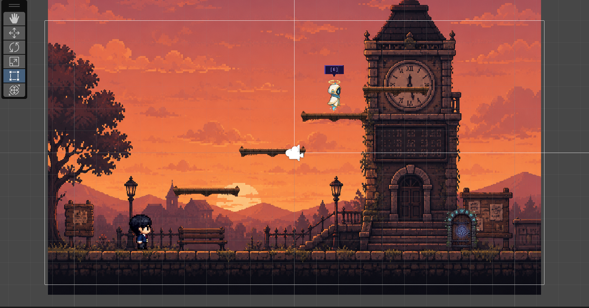
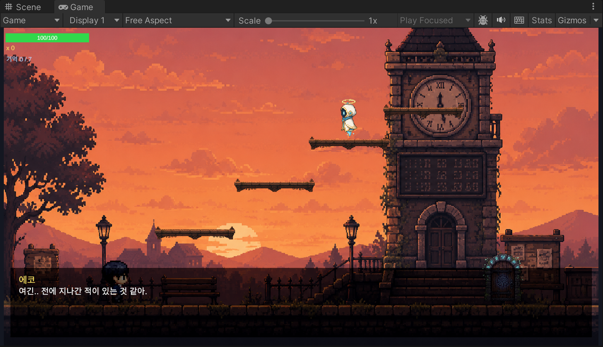

# ECHOES

> 기억을 잃은 주인공 '에코'가 자신의 내면 세계를 탐험하며 흩어진 기억의 조각을 되찾는 **Unity 2D 픽셀아트 스토리 플랫포머** — 1인 개발 포트폴리오 프로젝트

---

## 게임 소개

주인공 **에코(Echo)** 는 자신이 스스로 만든 기억 속 세계에서 눈을 뜹니다. NPC **기억지기**의 안내에 따라 스테이지 곳곳에 흩어진 **기억의 조각**을 모으다 보면, 조각 하나하나가 영어 단어 토큰(`"I"`, `"have"`, `"always"` …)이라는 것을 알게 됩니다. 모든 조각을 모아 올바른 순서로 배열하면 하나의 문장이 완성되고, 그것이 이 세계에 숨겨진 진실입니다.

<details>
<summary>핵심 문장 (스포일러)</summary>

> **"I have always loved you, my Echo."**

</details>

플랫포밍 이동·전투 위에 **대화/선택지, 숫자 암호 퍼즐, 단서 수집, 보스전**을 스테이지별 콘텐츠로 얹은 구조로, 각 스테이지를 클리어하면 기억 조각과 열쇠를 얻어 잠긴 문을 열고 다음 스테이지로 진행합니다.

## 게임 흐름

`Title → Tutorial → Stage1 ~ Stage5` (총 9개 씬, 시계탑·계산기 퍼즐 씬 포함)

| 콘텐츠 | 내용 |
|---|---|
| 영혼 빛 수집 | 떠다니는 영혼 빛 3개를 모아야 기억지기 NPC가 보상을 지급 (수집 → 대화 → 보상 게이트) |
| 선택지 대화 | ↑↓로 선택, Z로 확인. 정답을 골라야 기억 조각 획득, 오답은 재시도 |
| 숫자 암호 퍼즐 | 멈춘 시계탑(1자리), 낡은 계산기(4자리) — 단서 대화를 읽고 암호 입력 (H로 힌트) |
| 시간의 틈 | 전투 없는 분위기 스테이지. 단서 오브젝트 3개를 확인하면 컷신과 함께 진실의 일부가 드러남 |
| 보스전 | '어둠의 화신 블랭크' — HP 50% 이하에서 페이즈2 돌입 (가속, 3발 부채꼴 투사체, 순간이동) |

## 조작법

| 키 | 동작 |
|---|---|
| A / D (← / →) | 좌우 이동 |
| Space | 점프 (더블 점프 지원) |
| Z / J | 근접 공격 |
| E | 상호작용 (대화, 문, 퍼즐, 단서) |
| ↑↓ + Z | 선택지 / 대화 분기 선택 |
| 숫자키, Backspace, H, Enter, Esc | 암호 퍼즐 입력 / 힌트 / 제출 / 취소 |
| Tab | 기억 인벤토리 열기/닫기 |

## 기술 구현 포인트

### 플레이어 컨트롤 — 플랫포머 '손맛'
- **코요테 타임**(0.1초), **점프 버퍼**(0.1초), **가변 점프**(상승 중 키를 떼면 속도 컷) 구현
- 하강 중력 배수 2.2 / 짧은 점프 중력 배수 1.6의 better-gravity 처리, 더블 점프
- 입력·타이머는 `Update`, 물리 적용은 `FixedUpdate`로 분리. 접지 판정은 콜라이더 발밑 `OverlapBox`

### 전투 — 인터페이스 추상화
- `IDamageable` 인터페이스 하나로 플레이어·보스의 피격을 통일 — 공격 측(`PlayerAttack`)은 구체 타입을 모름
- 바라보는 방향 앞 `OverlapBoxAll` 히트박스로 다중 대상 판정, 쿨다운 기반 근접 공격

### 보스 AI — 코루틴 기반 2페이즈 패턴
- 코루틴 `BehaviorLoop`가 돌진 ↔ 투사체 패턴을 교대 순환, 대기 중엔 플레이어 방향으로 완만히 표류
- 페이즈2: 패턴 간격 ×0.6, 돌진 속도 ×1.4, 투사체 3발 부채꼴(20°) 분산, 순간이동 패턴 추가
- `OnBossHealthChanged` / `OnPhase2` / `OnBossDefeated` 이벤트로 HP바 UI·연출과 분리

### 대화 시스템 — 단일 진입점 코루틴
- `Begin(lines, choices, onComplete)` 하나로 일반 대화·선택지 분기·정답 판정·반응 대사를 모두 처리
- 타자기 효과(글자당 0.03초), E로 즉시 전체 표시, 키보드·마우스 입력 병행 지원
- 대화 중 플레이어 이동/공격 입력을 잠그고 종료 시 해제

### 퍼즐 — 데이터 주도 재사용 컴포넌트
- `NumberLockPuzzle` 단일 컴포넌트를 인스펙터 설정만 바꿔 시계탑·계산기 두 퍼즐에 공용 사용
- 자리수, 정답, 단서 대사, 보상(기억 조각·열쇠·문 개방·씬 이동)을 전부 `[SerializeField]`로 주입

### 전역 상태 — 이벤트 기반 싱글톤
- `GameManager`(DontDestroyOnLoad)가 기억 조각·열쇠·씬 전환의 단일 소스
- `OnMemoryCollected`, `OnKeyChanged` 등 C# `event(Action)`로 UI·월드가 구독 — 시스템 간 결합을 느슨하게 유지
- 중복 획득 무시, 열쇠 소모 성공 여부 bool 반환 등 방어적 설계

## 폴더 구조

```
Assets/
├── Scenes/            # Title, Tutorial, Stage1~5, ClockTower, Calculator (9개)
├── Scripts/           # C# 스크립트 28개, Echoes 네임스페이스
│   ├── Core/          # GameManager (영속 싱글톤, 진행 상태·씬 전환)
│   ├── Player/        # PlayerController, PlayerHealth, PlayerAttack
│   ├── Combat/        # IDamageable 인터페이스
│   ├── Dialogue/      # DialogueSystem, NPC 상호작용
│   ├── Puzzle/        # NumberLockPuzzle, TimeGapManager
│   ├── Memory/        # 기억 조각 데이터
│   ├── Boss/          # BossController, BossProjectile
│   ├── World/         # 영혼 빛 수집, 문/열쇠 등 월드 오브젝트
│   ├── UI/            # HUD, 기억 인벤토리, 타이틀 메뉴
│   └── Audio/
└── Screenshots/
```

## 기술 스택

| 항목 | 내용 |
|---|---|
| 엔진 | Unity **2022.3.62f3 (LTS)** |
| 렌더 파이프라인 | Built-in Render Pipeline + 2D Feature Set |
| 언어 | C# (레거시 Input System) |
| UI | uGUI + TextMeshPro (한글: Noto Sans CJK KR 폰트 에셋) |
| 그래픽 | 픽셀아트 — 기준 해상도 480×270, PPU 16, 타일 16×16, 캐릭터 32×32, Point 필터 |
| 개발 규모 | 1인 개발 |

## 실행 방법

1. 저장소 클론 후 **Unity 2022.3 LTS**로 프로젝트 열기
2. `File > Build Settings`에 `Assets/Scenes`의 씬이 모두 등록되어 있는지 확인 (씬 이름 기반 로드)
3. `Title` 씬을 열고 Play

## 스크린샷


